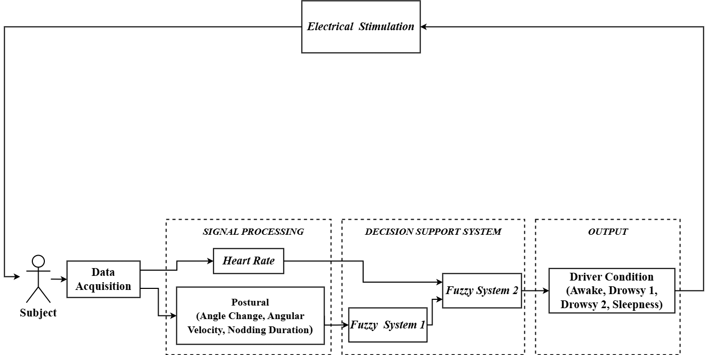
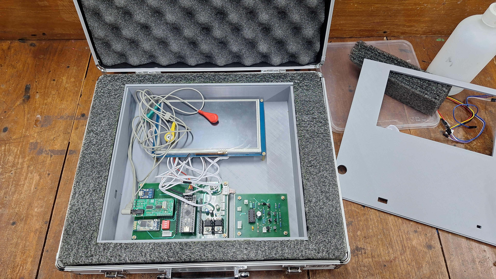
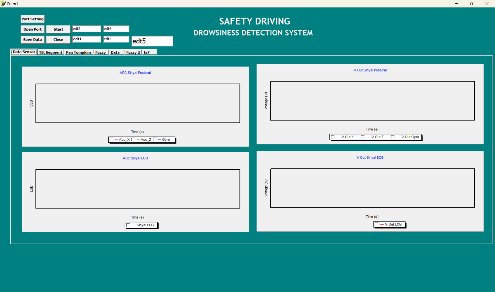
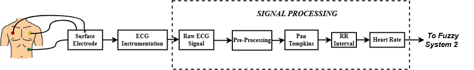
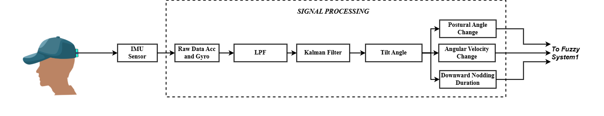
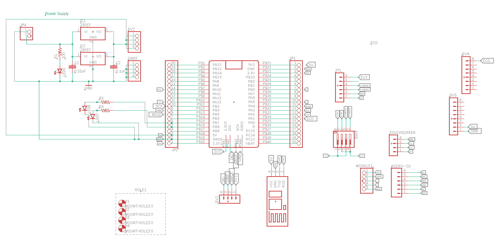

# Driver Drowsiness Detection System using Heart Rate and Postural Changes

## Overview
This project develops a driver drowsiness detection system using physiological and motion data. The system combines heart rate signals and postural changes to classify driver fatigue levels using a Fuzzy Inference System.

---

## System Overview

*Overall functional system diagram for driver drowsiness detection.*

---

## Hardware & Instrumentation

*Prototype device for acquiring ECG and postural data.*

---

## User Interface

*Graphical user interface for monitoring and visualization.*

---

## Data Acquisition

### ECG Signal Acquisition

*Acquisition of heart rate signals using ECG sensor.*

---

### Postural Data Acquisition

*Measurement of head movement and postural changes.*

---

## Hardware Design

*Circuit schematic of the embedded system including ECG sensor and motion sensors.*

## Features

### Physiological Features
- Heart Rate (BPM)

### Postural Features
- Head angle
- Angular velocity
- Nodding duration

---

## Methodology

- Signal acquisition from ECG and motion sensors
- Feature extraction from physiological and postural data
- Classification using **Fuzzy Inference System (FIS)**

---

## Key Findings

- Heart rate tends to decrease during drowsiness
- Postural angle and nodding duration increase
- Angular velocity decreases as fatigue increases

---

## Performance

- Achieved overall accuracy of **87.14%**

---

## Technologies
- Embedded System (STM32)
- Signal Processing
- ECG Sensor
- Accelerometer & Gyroscope
- Fuzzy Logic (FIS)

---

## Project Structure
- `embedded/` – Embedded system code  
- `interface/` – GUI application  
- `hardware/` – PCB and device design  
- `images/` – Diagrams and visualization assets  

---

## Author
Afan Ghafar
